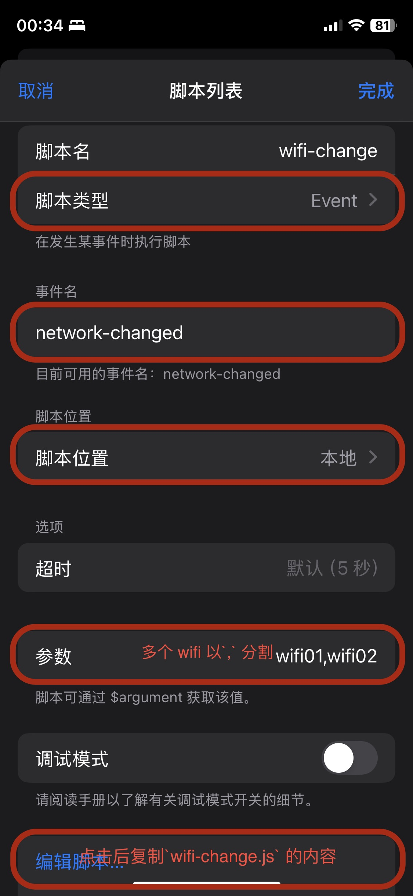

# Wifi change
[toc]
## 介绍
适用于当网络条件发生改变时自动切换 surge 出站模式：当 连接到指定 wifi 时，自动切换为 `直连` 模式；当连接到其他 wifi/cellular 时，自动切换为 `规则` 模式。
比如家里路由已实现了代理，同时需要 surge 的 mitm 等功能，那么我们就需要将策略改为 `直连` 模式而不是关闭 surge 的代理
## 使用方式
按下面截图方式使用即可，

